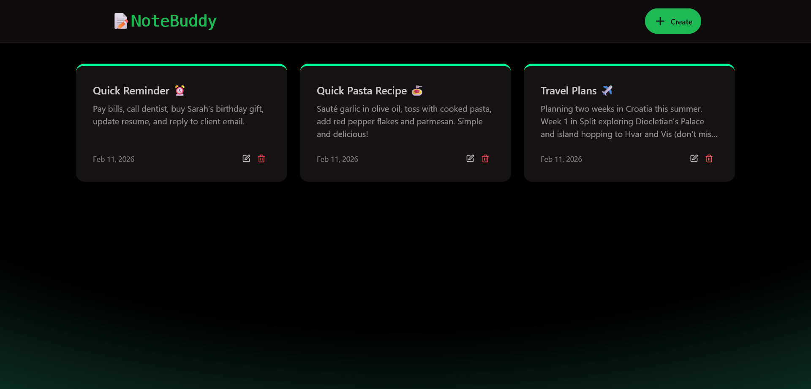
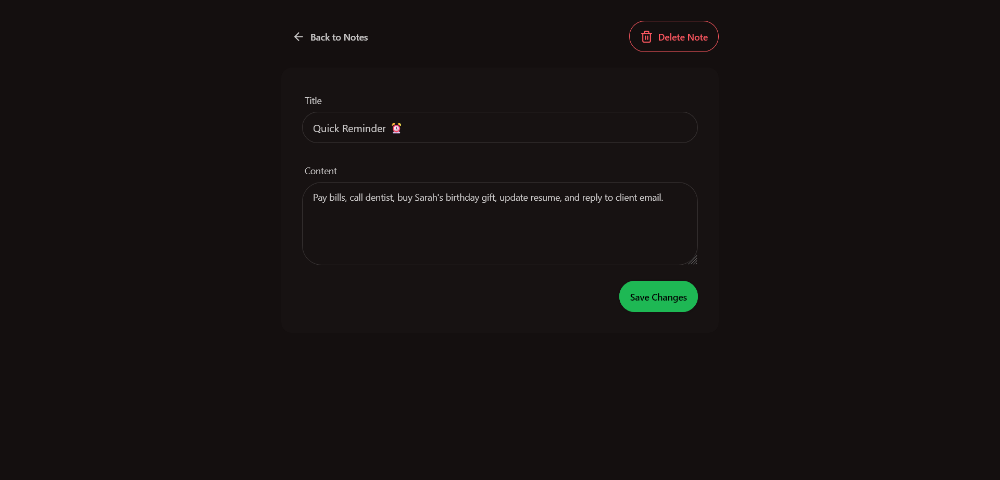
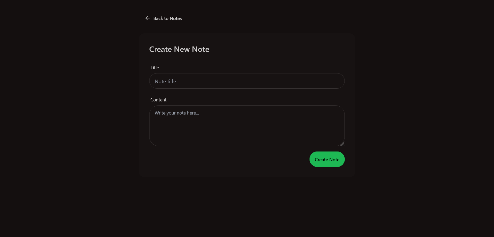

# 📝 NoteBuddy

A full-stack note-taking application built with the MERN stack. Create, edit, and manage notes with a clean interface and built-in API rate limiting.

---

## 🚀 Tech Stack


**Frontend:** React 19, Vite, React Router, Tailwind CSS, DaisyUI, Lucide Icons, Axios  
**Backend:** Node.js, Express 5, MongoDB, Mongoose, Upstash Redis  
**Features:** Rate limiting (20 req/60s), CORS, Toast notifications

---

## ✨ Key Features

- 📝 **CRUD Operations** - Create, read, update, and delete notes
- 🚦 **Rate Limiting** - API protection with Upstash Redis (20 requests per 60 seconds)
- 📅 **Auto Timestamps** - Track creation and update times
- 🎨 **Modern UI** - Gradient design with DaisyUI components
- 📱 **Responsive** - Mobile-first design that works everywhere
- ⚡ **Fast** - Built with Vite for optimal performance

---

## 🛠️ Setup

1. **Clone the repository**
   ```bash
   git clone https://github.com/hnedim/note-buddy.git
   cd note-buddy
   ```

2. **Configure environment variables** (`backend/.env`)
   ```env
   MONGO_URI=your_mongodb_connection_string
   PORT=5001
   NODE_ENV=development
   UPSTASH_REDIS_REST_URL=your_upstash_redis_url
   UPSTASH_REDIS_REST_TOKEN=your_upstash_redis_token
   ```

3. **Install dependencies**
   ```bash
   npm run build
   # Or separately: npm install --prefix backend && npm install --prefix frontend
   ```

4. **Run the application**
   ```bash
   # Development (run in separate terminals)
   cd backend && npm run dev
   cd frontend && npm run dev
   
   # Production
   npm start
   ```
   Frontend: `http://localhost:5173` | Backend: `http://localhost:5001`

---

## 🔌 API Endpoints

| Method | Endpoint | Description |
|--------|----------|-------------|
| GET | `/api/notes` | Get all notes |
| GET | `/api/notes/:id` | Get specific note |
| POST | `/api/notes` | Create new note |
| PUT | `/api/notes/:id` | Update note |
| DELETE | `/api/notes/:id` | Delete note |

---

## 📁 Project Structure

```
note-buddy/
├── backend/
│   ├── src/
│   │   ├── config/         # Database & Redis config
│   │   ├── controllers/    # Business logic
│   │   ├── middleware/     # Rate limiter
│   │   ├── models/         # MongoDB schemas
│   │   └── routes/         # API routes
│   └── package.json
└── frontend/
    ├── src/
    │   ├── components/     # React components
    │   ├── pages/          # Route pages
    │   └── lib/            # Utils & config
    └── package.json
```

---

## 📸 Screenshots

<div align="center">
  
  
  
</div>

---

## 👤 Author

**hnedim** - [github.com/hnedim/note-buddy](https://github.com/hnedim/note-buddy)

---

*Made with ❤️ using the MERN stack*